<!-- _class: invert -->

# LED Lanyard
An Open Source Wearable LED Lanyard

Presented by: Tommy Falgout 

---

# Agenda

- Intro
- Journey
- Know your LEDs
- Build Your Own!
- Q&A

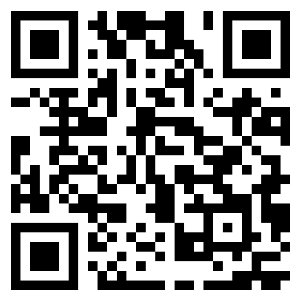

---

# Me

- Solution Architect @ Microsoft (ex-Yahoo!, ex-Nortel)
- Builder of trebuchets (IMDB)
- And amazingly enough, Dad (15 yo daughter)
- Color Blind (Deuteranomaly)

---

# Journey (Part 1)

- Dan Stach (friend) wanted to light Xmas tree using LEDs
- Went down WS2811 + Raspberry Pi rabbit hole
- Many public examples were in C++, so Dan ported them to Python

---

# Journey (Part 2)

https://www.ledlanyard.com/

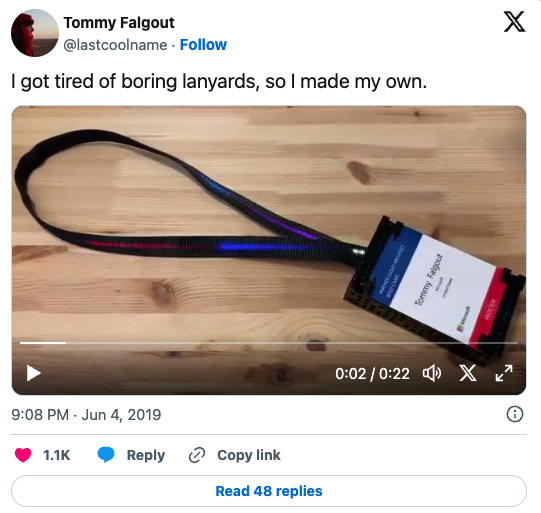

<!--
I learned so much from watching my friend Dan to making my own.  
This session will be about things I learned to help save you from those mistakes, unreturnable Amazon purchases and the sea of confusing lingo, specifications and math.

-->

---

# Journey (Part 1.5)

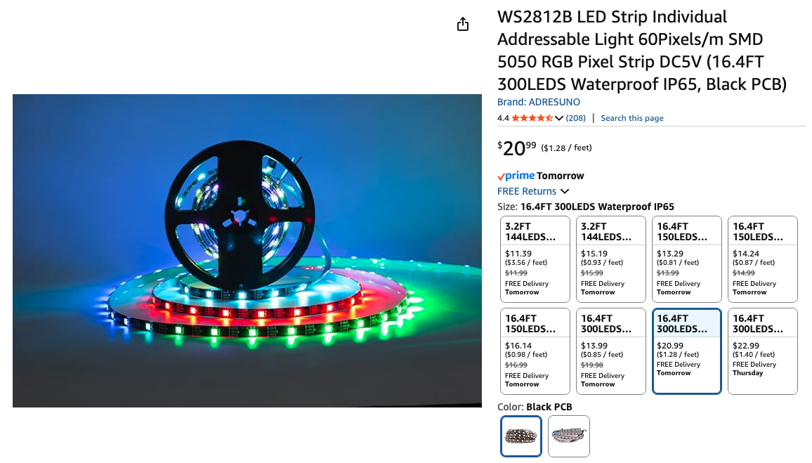

---

<!-- _class: invert -->

# Concepts

---

# Acronyms

- LED (Light Emitting Diode) - turns electricity into light
  - LED Bulb - great for home light plugs, limited on colors
  - LED Strip - powered by wall plugin or USB, 1 pixel wide, sometimes addressable
- IC (integrated circuit) - tiny computer chip
- RGB (Red Green Blue) - additive color mode of 3 primary colors.  Primary for digital displays 
  - RGBW (adds White)
- AC (Alternating Current) - home/plugin power (US)
- DC (Direct Current) - batteries, solar cells
- Raspberry Pi (aka RPi) - Really tiny computer ($30-$50)
- ESP32 - low-cost, low-power microcontroller ($10 or less)

---

<!-- _class: invert -->

# LEDs

---

# DIP LED

- Dual In-Line Package
- Resemble traditional light bulb
- Great for starting
- Cost + size prohibitive for "production"

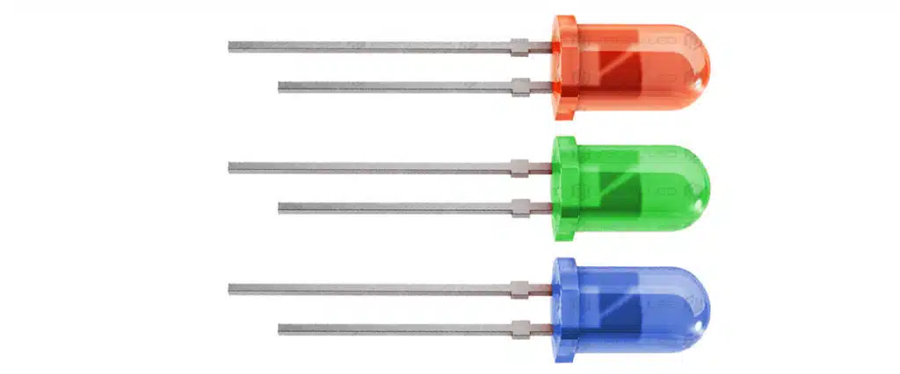

<!--
_footer: Credit https://visualled.com/en/glossary/led-dip/
-->

---

# SMD LED

- Surface Mounted Device
- Described by the dimensions of the LED package
  - e.g. 8520 is 8.5mm x 2.0mm

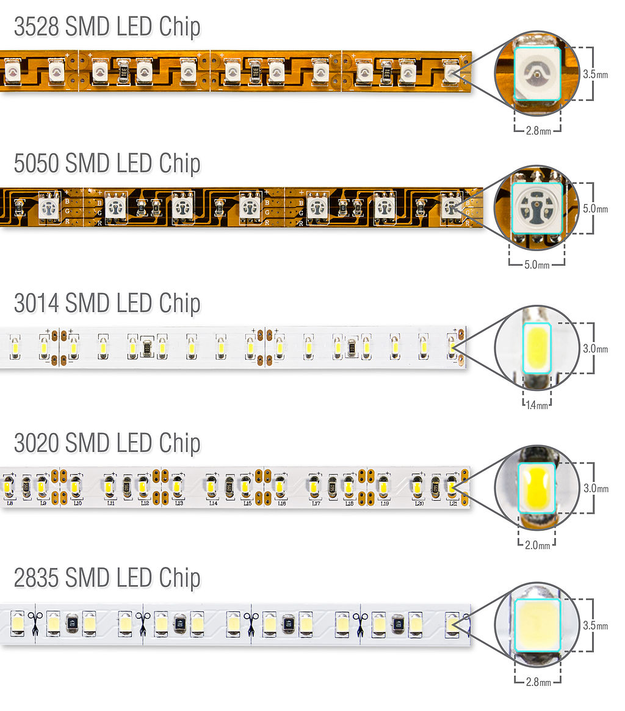

<!--
_footer: Credit https://en.wikipedia.org/wiki/SMD_LED
-->

---

# COB LED

- Chip On Board
- smaller diodes
- Claim: one continuous, smooth light source (No spots or dots)
- Reality: Not perfect to being dot-free, but pretty close
- New hotness in LED

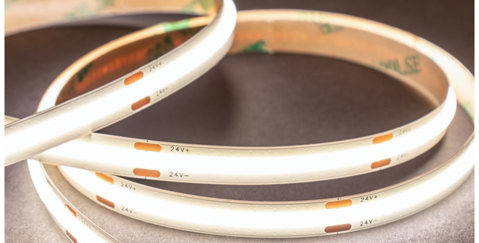
<!--
_footer: Credit https://hitlights.com/blogs/premium-led-strip-lighting/captivating-cob-lights-what-are-cob-led-strip-lights-and-how-to-use-the
-->

---

# Comparison

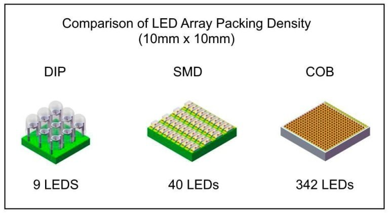

<!--
_footer: Credit https://nseledcloud.com/dip-led-vs-smd-led/
-->

---

# Size

* 3528, 5050, 2835, etc.
* Correlate to the size of the chip (in mm)
* Might affect LED strip width (8mm vs 10mm)

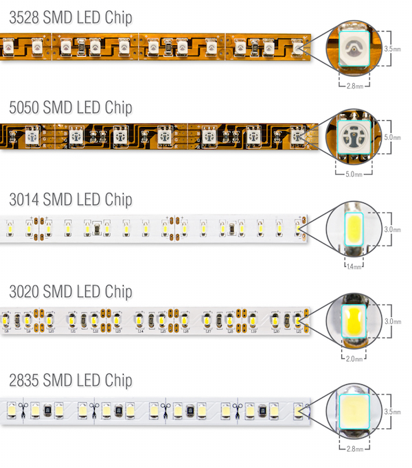

<!--
_footer: Credit https://www.flexfireleds.com/comparison-between-3528-leds-and-5050-leds/
-->

---

# LED chips (most common)

- WS2811 - LED driver IC (NOT the LED)
  - DC 12V, 8 pins (6 used)
  - Use Case: larger spacing, signage
- WS2812 - RGB LED + driver IC (integrated)
  - DC 5V, 6 pins
  - Use Case: compact strips, wearables
- WS2812B
  - DC 5V, 4 Pins, more compact and robust
  - Recommended for new project (reliability + wiring)
  - NeoPixel (Adafruit's brand)
- WS2815
  - DC 12V, more reliable
  - Commercial

---

# Alternate types

- NON-individual addressable
- NEON Lookalikes (strip inside silicon)
- Circuit boards (rings, jewels, individuals, matrix, flexible, strings, sewable)
- DotStar LED - similar to Neopixels, different interface

---

# NeoPixel

- Adafruit's brand of addressable RGB LED
- Based on the WS2812 & WS2811 LED/drivers
- Extensive libraries and support via Adafruit
- Used in wearable tech, custom Lightsabers, interactive displays
- Many form factors (strips, grid, circle)

<!--
_footer: TL;DR: Thank you Lady Ada for making a really easy way to work with tiny LEDs!
-->

---

# Density

- 30 LED / meter, 60, 144
- More isn't always better
  - can get expensive + use more power

---

# Weatherproof

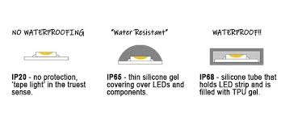

- IP = Ingress Protection (rating)
- IP20 - no waterproofing (indoor use only)
- IP30 - no waterproofing (slightly better than IP20)
- IP65 - water resistant (damp locations)
- IP67 - waterproof (good for outdoor, wet locations)
- IP68 - full waterproof (underwater)

<!--
_footer: Source https://www.ledsupply.com/blog/ip68-waterproof-led-strips-lights-for-pools-saunas-and-outdoors/
-->
---

<!-- _class: invert -->

# Controlling LEDs

---

# FastLED

- OSS Library
  - Platform: Arduino, ESP32, RPi, and more
  - Interface: Code
  - Supports: WS2812 (and others)
- Can drive 1000's of LEDs
- Efficient + Easy + Community
- https://fastled.io/

---

# WLED

- OSS Soft/Firmware
  - Platform: ESP32, ESP8266
  - Interface: Web + Wifi
  - Supports: WS2812B
  - Power: 5V, 12V, 24V
- https://kno.wled.ge/
- [WLED Beginners Guide](https://youtu.be/exAWzMfmwQ8?si=qRZxCbeIZCoc9zmH) (YouTube)
---

# NightDriver

- OSS Soft/Firmware
- Similar to WLED
  - More programmable
  - Smaller community
- https://nightdriverled.com

---

# Pixelblaze

- Paid Hardware + Software
  - Platform: ESP
  - Interface: Web + WiFi
  - Can write pattenrs in Javascript
- https://electromage.com/pixelblaze

---

# Off-the-shelf

- Amazon kits
  - Platform: pre-built hardware
  - Interface: remote control
  - Supports: WS2812B (and sometimes others)
  - Power: 5V, least consumption (~.2-.4A)
- Example: 
  - [14 key Wireless RF Remote + LED RGB Controller for WS2812B](https://amzn.to/4hyVnYn)

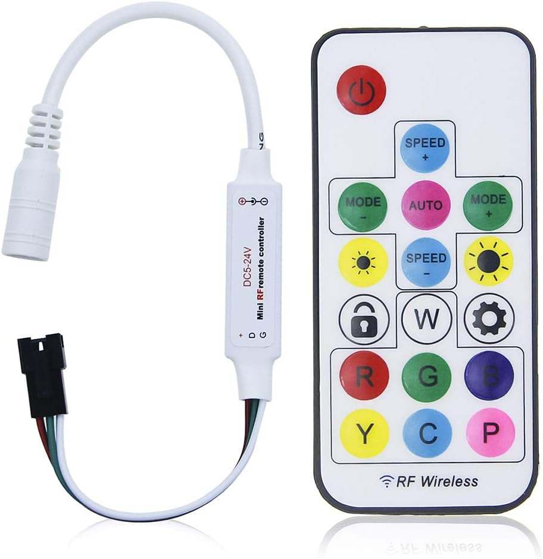

---

# Larson Scanner

- Cylon Heads in Battlestar Galactica
- KITT's Scanner in Knight Rider
- Maximilian's Scanner in The Black Hole

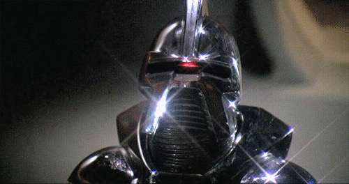

---

<!-- _class: invert -->

# Basic LED Lanyard

---

# Batteries + Power Consumption

WARNING:  MATH INVOLVED

---

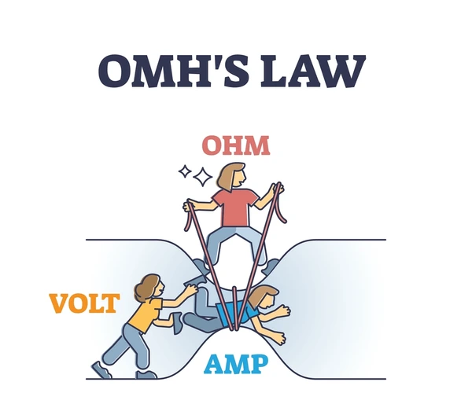

- Volts = pressure pushing the water through the pipe
- Amps = flow rate of the water 
  (how much is moving)
 - Ohms = resistance in the pipe 
  (how hard it is for water to flow)

---

# Battery Capacity

- mAh = how long a device can run
- Think of mAh as the size of a fuel tank:
  - A 2000 mAh battery can power a 100 mA device for 20 hours
  - Higher mAh = longer runtime

---

# How do you measure this?!

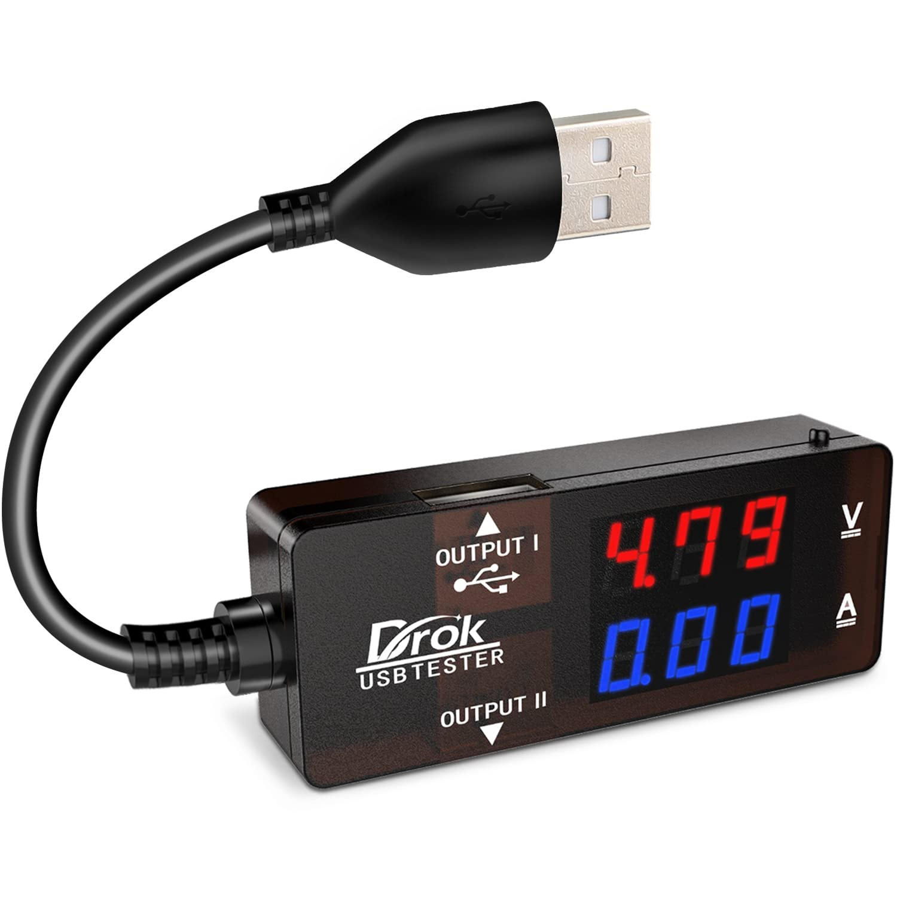
- [USB multimeters](https://amzn.to/45PBLf5) are your friend!

---

# Example 

- 5 meter WS2812B strip, 60 p/m, 5050 RGB, DC5v
- Full brightness, all LED on white
- Device current draw: 1.8 A
- Battery capacity: 10,000 mAh = 10 Ah
- Battery life = Battery capacity ÷ Device current
- Battery life = 10 Ah ÷ 1.8 A = 5.56 hours

---

# Bill of Materials (BOM)

- [WS2812B LED Strip SMD 5050 RGB DC5V IP20 144 pixels/m](https://amzn.to/4m922vz)
- [Portable battery](https://amzn.to/4iwiILw)
- [5.5mm x 2.1mm Barrel Jack to Micro-USB Cable](https://amzn.to/4hc28PR)
- [Tubular Polyester Webbing](https://amzn.to/3DVsmZ8)

<!--
_footer: FYI, links are Amazon Associates.  My day job pays me enough that I don't need it, but it's fun to see the nickles roll in.
-->

---

# Case options

- Cigar box - cheap $1-free
- Craft case
- 3d print
- LEGO

---

# Gotchas

- Be careful of too much flex

---

<!-- _class: invert -->

# FIN

---

# Reminder

- [LEDLanyard.com](https://www.ledlanyard.com) 
- Rate this session!