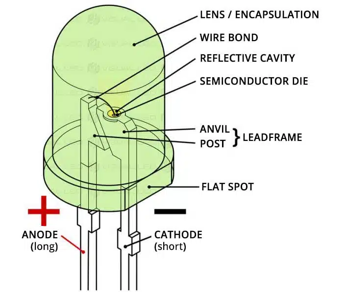

<!-- _class: invert -->

# LED Lanyard
An Open Source Wearable LED Lanyard

Presented by: Tommy Falgout 

---

# Agenda

- Intro
- Origin Story
- Know your LED's
- Build Your Own!
- Q&A

---

# Me

- Cloud Architect @ Microsoft (ex-Yahoo!, ex-Nortel)
- Builder of trebuchets (IMDB)
- And amazingly enough, Dad (13 yo daughter)
- Color Blind (Deuteranomaly)

---

# Origin Story (Mark 1)

- Dan Stach (friend) wanted to light Xmas tree using LEDs
- Went down WS2811 + Raspberry Pi rabbit hole
- Many public examples were in C++, so Dan ported them to Python

---

# Origin Story (Mark 2)

https://www.ledlanyard.com/

---

<!-- _class: invert -->

# Concepts

---

# Acronyms

- LED (Light Emitting Diode) - turns electricity into light
  - LED Bulb - great for home light plugs, limited on colors
  - LED Strip - powered by wall plugin or USB, 1 pixel wide, sometimes addressable
- IC (integrated circuit) - tiny computer chip
- RGB (Red Green Blue) - additive color mode of 3 primary colors.  Primary for digital displays 
  - RGBW (adds White)
- AC (Alternating Current) - home/plugin power (US)
- DC (Direct Current) - batteries, solar cells or AC/DC converters
- Raspberry Pi (aka RPi) - Really tiny computer, runs Linux

---

# DIP LED

- Dual In-Line Package
- Resemble traditional light bulb
- Great for starting
- Cost + size prohibitive for "production"

<!--
_footer: Credit https://visualled.com/en/glossary/led-dip/
-->

---

# SMB LED

- Surface Mounted Device
- Described by the dimensions of the LED package
  - e.g. 8520 is 8.5mm x 2.0mm

<!--
_footer: Credit https://en.wikipedia.org/wiki/SMD_LED
-->

---

# COB LED

- Chip On Board
- smaller diodes
- Claim: one continuous, smooth light source (No spots or dots)
- Reality: Not perfect to being dot-free, but pretty close
- New hotness in LED

<!--
_footer: Credit https://hitlights.com/blogs/premium-led-strip-lighting/captivating-cob-lights-what-are-cob-led-strip-lights-and-how-to-use-the
-->

---

<!-- _class: invert -->

# Comparison

<!--
_footer: Credit https://nseledcloud.com/dip-led-vs-smd-led/
-->

---

# LED chips (most common)

- WS2811 - LED driver IC (NOT the LED)
  - DC 12V, 8 pins (6 used)
  - Use Case: larger spacing, signage
- WS2812 - RGB LED + driver IC (integrated)
  - DC 5V, 6 pins
  - Use Case: compact strips, wearables
- WS2812B
  - DC 5V, 4 Pins, more compact and robust
  - Recommended for new project (reliability + wiring)
  - NeoPixel (Adafruit's brand)

---

# Alternate types

- NON-individual addressable
- NEON Lookalikes (strip inside silicon)
- Circuit boards (rings, jewels, individuals, matrix, flexible, strings, sewable)
- DotStar LED - similar to Neopixels, different interface

---

# RGB vs RGBW (white)

- Can consume more power
- Can skip if doing simple animation

---

# Weatherproofing

- no waterproofing (IP20) - indoor use only
- IP65 - water resistant (suitable for damp)
- IP67 waterproof (good for outdoor, wet locations)
- IP68 - fully waterproof (underwater lighting)

---

# NeoPixel

- Adafruit's brand of individually addressable Red Green Blue (RGB) LED
- Based on the WS2812 & WS2811 LED/drivers
- Extensive libraries and support via Adafruit
- Used in wearable tech, custom Lightsabers, interactive displays
- Many form factors (strips, grid, circle)

<!--
_footer: TL;DR: Thank you Lady Ada for making a really easy way to work with tiny LEDs!
-->

---

# Density

- 30 LED / meter, 60, 144
- More isn't always better
  - can get expensive + use more power

---

<!-- _class: invert -->

# Controlling LED's

---

# FastLED

* OSS Library
  * Platform: Arduino, ESP32, RPi, and more
  * Interface: Code
  * Supports: WS2812 (and others)
* Can drive 1000's of LED's
* Efficient + Easy + Community
* https://fastled.io/

---

# WLED

* OSS Firmware
  * Platform: ESP32, ESP8266
  * Interface: Web
  * Supports: WS2812B
  * Power: 5V, 12V, 24V
* https://kno.wled.ge/

---

# Off-the-shelf

* Amazon kits
  * Platform: pre-built hardware
  * Interface: remote control
  * Supports: WS2812B (and sometimes others)
  * Power: 5V, least consumption (~.2-.4A)
* Example: 
  * [14 key Wireless RF Remote + LED RGB Controller for WS2812B](https://amzn.to/4hyVnYn)

---

# Larson Scanner

* Cylon Heads in Battlestar Galactica
* KITT's Scanner in Knight Rider
* Maximilian's Scanner in The Black Hole

---

<!-- _class: invert -->

# Basic LED Lanyard

---

# Build of Materials (BOM)

* [WS2812B RGB LED Strip 144 pixels](https://amzn.to/4hdh5Bf)
* [Portable battery](https://amzn.to/4iwiILw)
* [5.5mm x 2.1mm Barrel Jack to Micro-USB Cable](https://amzn.to/4hc28PR)
* [Tubular Polyester Webbing](https://amzn.to/3DVsmZ8)

<!--
_footer: FYI, links are Amazon Associates.  My day job pays me enough that I don't need it, but it's fun to see the nickles roll in.
-->

---

# Case options

* Cigar box - cheap $1-free
* Craft case
* 3d print
* LEGO

---

# Smart LED Lanyard

Replace integrated controller with RPi